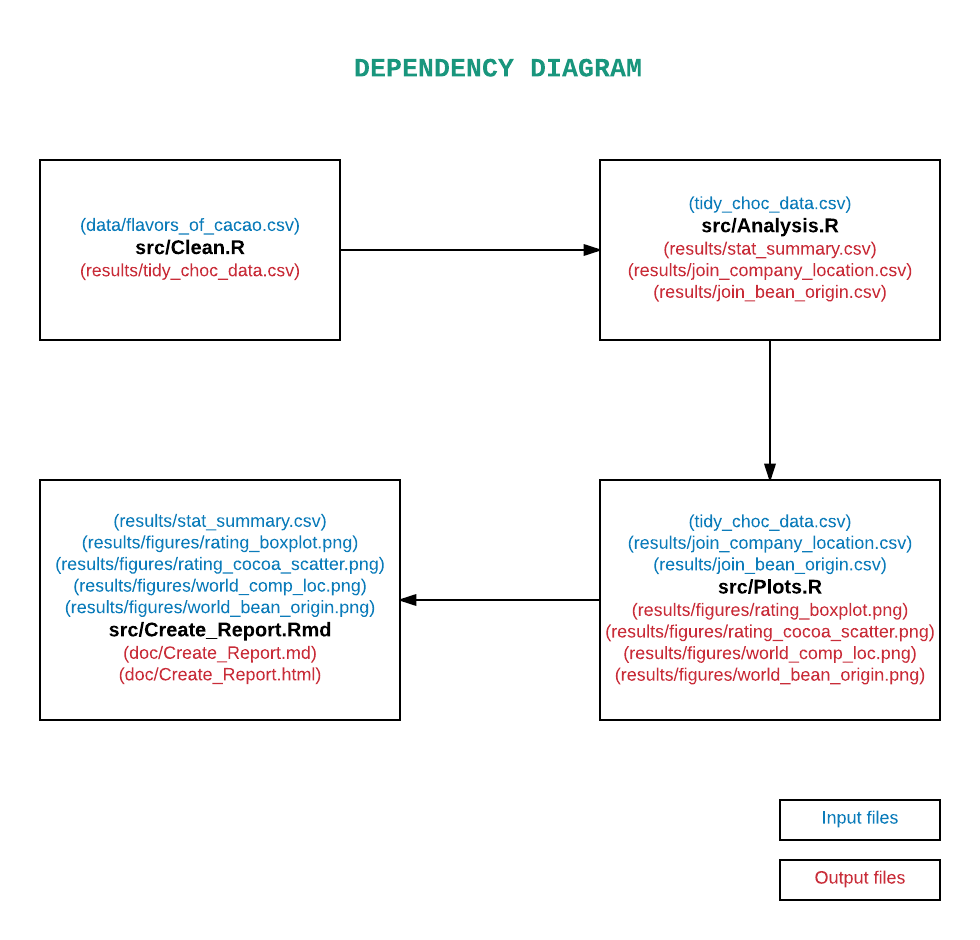

## README

Author: **TARINI BHATNAGAR**

Date created: December 9th, 2017


## Overview

There is nothing better than the smooth texture and rich taste of a piece of chocolate. Almost everyone is a huge fan of this delicacy made out of Theobroma cacao seeds, roasted and ground. 
However, not all chocolates are same!
This dataset contains expert ratings of over 1,700 individual chocolate bars, along with information on their regional origin, percentage of cocoa, the variety of chocolate bean used and where the beans were grown.

## Data

Data source: [https://www.kaggle.com/rtatman/chocolate-bar-ratings](https://www.kaggle.com/rtatman/chocolate-bar-ratings).
This dataset has been released under [CCO:Public Domain](https://creativecommons.org/publicdomain/zero/1.0/)

However, a kaggle account is required in order to download this dataset. Hence, a copy of the dataset has been provided in the ```data``` directory.	

**Column metadata:**

* Company
* Specific Bean Origin
* REF
* Review Date
* Cocoa Percent
* Company Location
* Rating
* Bean Type
* Broad Bean Origin

**Flavors of Cacao Rating System:**

* 5 : Elite (Transcending beyond the ordinary limits)
* 4 : Premium (Superior flavor development, character and style)
* 3 : Satisfactory(3.0) to praiseworthy(3.75) (well made with special qualities)
* 2 : Disappointing (Passable but contains at least one significant flaw)
* 1 : Unpleasant (mostly unpalatable)	
	
## Objectives

**Exploratory analysis**

Since I have recently learned the limitless possibilities of data anaylsis and visualization in R, I am going to perform an exploratory analysis of this dataset. 

Hypothesis: Best rated chocloates have the highest percentage of Cocoa and come mainly from Central and South America.

Testing this hypothesis will include investigating the following questions: 

* Is there a relationship between Cocoa percentage and Rating of chocolates?
* Which region produces the highest rated chocolates?
* Summary of Ratings
* Where are the beans of highest rated chocolate bars grown?


## Analysis

First, I perform some tidying tasks and write the data to a new .csv file ([Clean.R](https://github.com/tarinib/Chocolate_Bar_Ratings/blob/master/src/Clean.R)) . Data cleaning involves replacing spaces in attribute names with `_`, convert columns to correct data type, correcting country name acronyms among others. 

The cleaned data is then analyzed ([Analysis.R](https://github.com/tarinib/Chocolate_Bar_Ratings/blob/master/src/Analysis.R)) to produce statistical summary of all attributes. I also join dataframes with world map data using ISO country codes in order to plot the attributes on world map.

After analysis, I focus on data visualization ([Plots.R](https://github.com/tarinib/Chocolate_Bar_Ratings/blob/master/src/Plots.R)). Here, I create a boxplot of chocolate ratings which informs us about its ditribution, median, range etc. The second plot takes a look at the relationship between chocolate rating and cocoa bean percentage. The last two plots visualize the distribution of origin of beans (and their average rating) and company locations of highest rated chocolates on a world map. By highest rating I mean a rating of 4 or 5, which places the chocolate in 'elite' or 'premium' category. Color coding the above plots might help in identifying the regions producing the highest rated chocolates (both according to origin of beans and company location).

Lastly, a report is produced summarizing all my findings and my interpretation about the hypothesis ([Creat_Report.Rmd](https://github.com/tarinib/Chocolate_Bar_Ratings/blob/master/src/Create_Report.Rmd)).

## Usage

This analysis can be reproduced in 3 ways:

### Makefile 
##### Project dependencies listed at the end of this page need to be met for this approach to run successfully.

* Clone this repository:

	```
	git clone https://github.com/tarinib/Chocolate_Bar_Ratings.git
	```

* Navigate to the repository on your local machine and delete previous output files.

	```
	make clean
	```
	
*  Reproduce analysis.

	```
	make all
	```

#### Pipeline graph for makefile


#### Dependency graph for makefile (from makefile2graph)


### Dockerfile
##### This approach enables you to reproduce analysis without having any project dependencies.

* Clone this repository:

	```
	git clone https://github.com/tarinib/Chocolate_Bar_Ratings.git
	```

* Use launchpad/Finder/Start menu/etc to find and launch Docker.
* Open command line (terminal/GitBash) and type:

	```
	docker pull tarini24/chocolate_bar_ratings
	```

* Verify that it successfully pulled by typeing: docker images, you should see something like:

	```
	REPOSITORY                           TAG                 IMAGE ID            CREATED             SIZE
	tarini24/chocolate_bar_ratings       latest              af41344062df        6 hours ago         1.84 GB
	```

* Run the Docker image and link it to your local version of the repository:

	```
	docker run -it --rm -v local_directory_of_this_repo:/Chocolate_Bar_Ratings tarini24/chocolate_bar_ratings /bin/bash
	```

* From the root in the Docker container go to the project folder. 

	```
	cd Chocolate_Bar_Ratings
	```
	
* Clean previous output files.
	
	```
	make clean
	```
	
* Run makefile to reproduce analysis.

	```
	make all
	```

### Packrat
##### This approach enables you to reproduce analysis without having any project dependencies.

* Clone this repository:

	```
	git clone https://github.com/tarinib/Chocolate_Bar_Ratings.git
	```
	
* Open it in RStudio by clicking on the ```Chocolate_Bar_Ratings.Rproj``` file.

* Type the following commands in shell(in the same order):
 
	This command runs src/Clean.R taking raw data file (in data folder) as input and creates a tidy version in results folder.

	```
	Rscript src/Clean.R https://raw.githubusercontent.com/tarinib/Chocolate_Bar_Ratings/master/data/flavors_of_cacao.csv results/tidy_choc_data.csv
	```
	
	This command runs src/Analysis.R taking tidy data file as input and creates a data summary .csv, and 2 separate .csv joining the data with world map data in results folder.

	```
	Rscript src/Analysis.R results/tidy_choc_data.csv results/stat_summary.csv results/join_company_location.csv results/join_bean_origin.csv
	```

	This command runs src/Plots.R taking the tidy data and joint dataframes as input and creates 4 plots in results/figures folder.
	
	```
	Rscript src/Plots.R results/tidy_choc_data.csv results/join_company_location.csv results/join_bean_origin.csv
	```

	This command runs src/Create_Report.Rmd taking the data summary and 4 plots as input and produces a rendered .md file in doc folder containing the plots and their interpretation. 
	
	```
	Rscript -e 'ezknitr::ezknit("src/Create_Report.Rmd", out_dir = "doc")'
	```
 
*NOTE: You can change the name of output files in the above queries starting from first command, but make sure to use the same names as input in the following commands.*


## Project dependencies

* R
* RStudio
* R packages: ```colorRamps```,  ```countrycode```,   ```ezknitr```, ```knitr```, ```maps```, ```RColorBrewer```, ```tidyverse```

## Acknowledgement

These ratings were compiled by Brady Brelinski, Founding Member of the Manhattan Chocolate Society. The dataset has been taken from kaggle.com.

