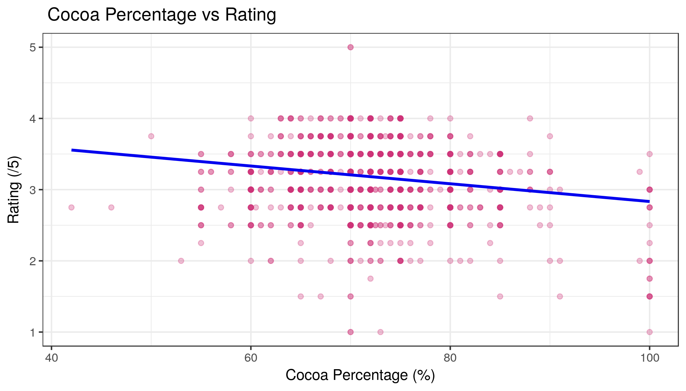
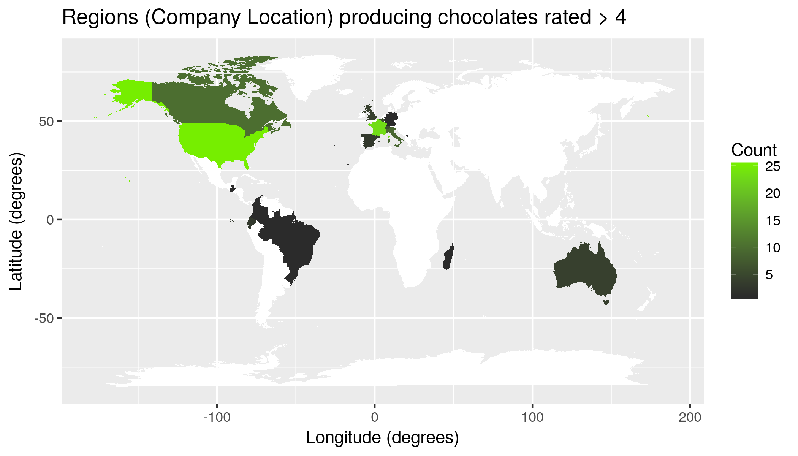
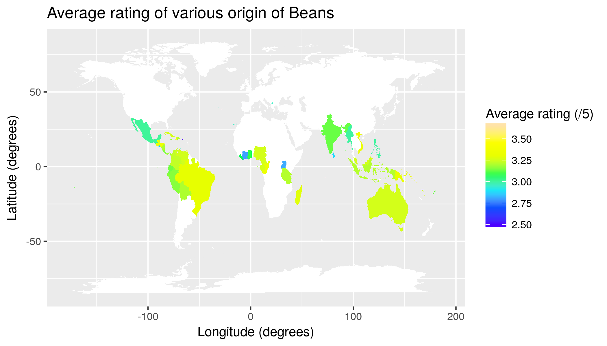

## Chocolate Bar Ratings

There is nothing better than the smooth texture and rich taste of a piece of chocolate. Almost everyone is a huge fan of this delicacy made out of Theobroma cacao seeds, roasted and ground. 

However, not all chocolates are same!

This dataset contains expert ratings of over 1,700 individual chocolate bars, along with information on their regional origin, percentage of cocoa, the variety of chocolate bean used and where the beans were grown.
This project report presents an exploratory data analysis of chcocolate bar ratings dataset from kaggle.com.

Data source: [https://www.kaggle.com/rtatman/chocolate-bar-ratings](https://www.kaggle.com/rtatman/chocolate-bar-ratings).

This dataset has been released under [CCO:Public Domain](https://creativecommons.org/publicdomain/zero/1.0/)

## Dataset Summary


```r
library(knitr)
library(tidyverse)
read_csv("results/stat_summary.csv") %>% kable()
```


|Company__(Maker-if_known) |Specific_Bean_Origin_or_Bar_Name |REF          |Review_Date  |Cocoa_Percent |Company_Location |Rating        |Bean_Type        |Broad_Bean_Origin |
|:-------------------------|:--------------------------------|:------------|:------------|:-------------|:----------------|:-------------|:----------------|:-----------------|
|Length:1795               |Length:1795                      |Min.   :   5 |Min.   :2006 |Min.   : 42.0 |Length:1795      |Min.   :1.000 |Length:1795      |Length:1795       |
|Class :character          |Class :character                 |1st Qu.: 576 |1st Qu.:2010 |1st Qu.: 70.0 |Class :character |1st Qu.:2.875 |Class :character |Class :character  |
|Mode  :character          |Mode  :character                 |Median :1069 |Median :2013 |Median : 70.0 |Mode  :character |Median :3.250 |Mode  :character |Mode  :character  |
|NA                        |NA                               |Mean   :1036 |Mean   :2012 |Mean   : 71.7 |NA               |Mean   :3.186 |NA               |NA                |
|NA                        |NA                               |3rd Qu.:1502 |3rd Qu.:2015 |3rd Qu.: 75.0 |NA               |3rd Qu.:3.500 |NA               |NA                |
|NA                        |NA                               |Max.   :1952 |Max.   :2017 |Max.   :100.0 |NA               |Max.   :5.000 |NA               |NA                |

## Data Visualization

### Chocolate bar ratings


This plot represents the ditribution of rating of all data points. As we can see, the median rating is approximately 3.3/5 (satisfactory-premium quality of chocolate), with the first and third quantile at approximately 2.7 and 3.5 respectively. Most of the data points lay between ~2.4 - 4.1 ratings. Out of these, we have more chocolates bar above rating of 3, which is the border line between disappointing and satisfactory chocolate.

### Cocoa Percentage vs Rating



I converted the Cocoa Percent column (originally) string by removing the "%" symbol and casting it to numeric type. The above image shows the scatter plot of cocoa percentage vs rating of chocolates with a linear regression line fit through the data points. The plots seems to suggest that there is a slightly negative relationship between these two factors.

The highest percentage of cocoa bean is in Unsweetened chocolate, followed by Bittersweet, Semisweet, Milk, Dark milk and White chocolate. As cocoa bena percentage decreases,the sugar increases (along with the percentage of milk products in milk and white chocolate). 

The slightly negative trend makes sense as not everyone enjoys a piece of bitter chocolate. Chocolate flavor preferences, like wine, vary with each of our palates. Also, other factors like quality of beans, fermentation, drying and roasting are equally important in producing a good tasting chocolate.

### World map of company locations producing highest rated (>=4) chocolates



Here, we can see the distribution of company locations producing the best quality chocolates belonging to premium and elite categories (rating greater tha or equal to 4). U.S. and France are the top scorers with around 25 counts, followed by Italy and Canada. The difference between the first and second tiers is quite large, around 10 counts. The third tier consists of Switzerland and Belgium. It is interesting to note that inspite of their position in this map,  Swiss and Belgian chocolate is world famous. It might be the case that chocolate production from these countries is outsourced to U.S. making it a dominant country in company location map.

### World map of cocoa bean origin



This map shows distribution of cocoa bean origin and the average rating of chocolates from that region. It is no surprise that the cocoa beans of highest rated chocolate originated in Central and South Ammerica, including Tobago, Mexico, Ecuador, Venezuela, Brazil among others, with an average rating of 3.6/5. Cocoa originated in Central America over 5000 years ago, and benefits from good soil and climate, mineral-rich volcanic soil and tropical equatorial climate. Even West Africa has become a major play in this field producing ~3 rated chocolate beans. India, Australia and many south east Asian countries seem to popular cocoa producing nations.

One of my objectives was to test the hypothesis that the best rated chocolates have the highest percentage of Cocoa and come mainly from Central and South America.
Analyzing the plots above, I think that although the best rated chocolate come from Central and South America, we cannot conclude that the best rated chocolates have the highest percentage of Cocooa. Instead, we could observe the rating goes down with increasing percentage of Cocoa. But, this is dependent on an individual's pallette and liking since high cocoa content makes the chocolate quite bitter.
